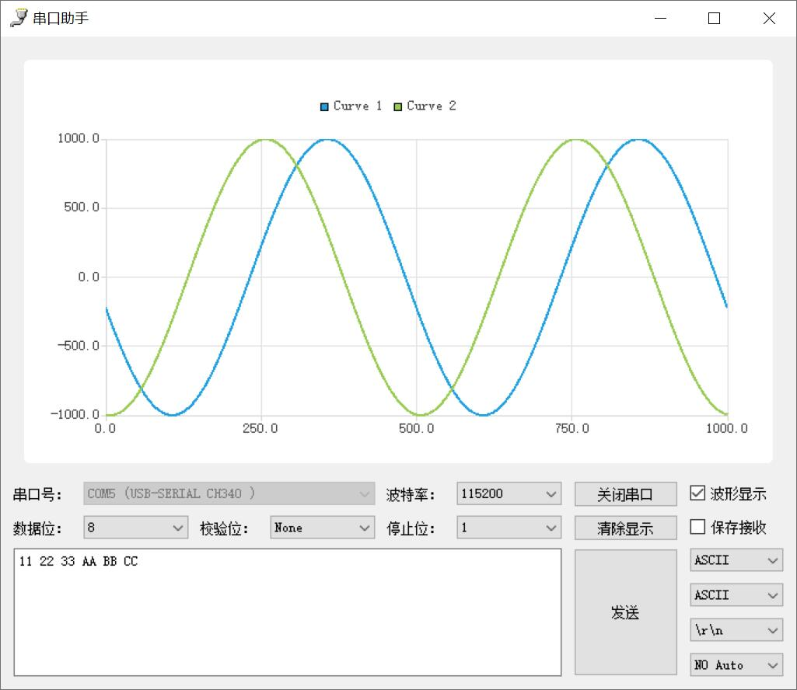
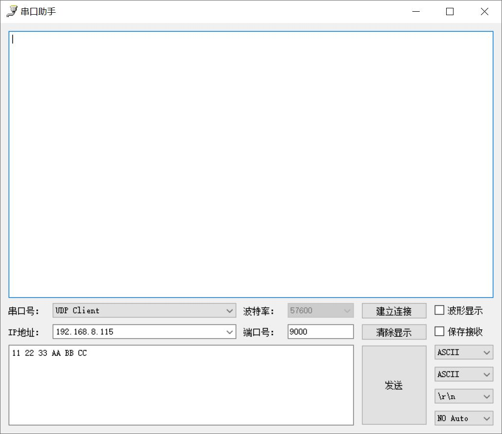

# SERCOM
serial assistant written in python

to run this software, you need python 3.6, pyqt5, pyqtchart and pyserial

## COM

## UDP

## data format
data format for wave show:
+ 1 wave: 11, 22, 33,
+ 2 wave: 11 22, 33 44, 55 66,
+ 3 wave: 11 22 33, 44 55 66, 77 88 99,
+ 4 wave: 11 22 33 44, 55 66 77 88, 99 11 22 33,

data format for hex send: 11 22 33 44 AA BB CC DD
